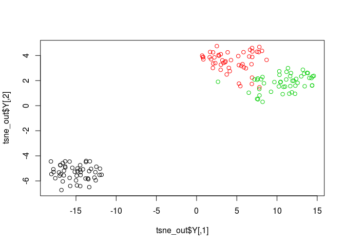

<!-- README.md is generated from README.Rmd. Please edit that file -->
R wrapper for multicore Tsne
============================

Installation
------------

To install the latest version from the github repository, use:

``` r
if(!require(devtools)) install.packages("devtools") # If not already installed
devtools::install_github("RGLab/Rtsne.multicore")
```

Usage
-----

After installing the package, use the following code to run a simple example (to install, see below).

``` r
library(Rtsne.multicore) # Load package
iris_unique <- unique(iris) # Remove duplicates
mat <- as.matrix(iris_unique[,1:4])
set.seed(42) # Sets seed for reproducibility
tsne_out <- Rtsne.multicore(mat) # Run TSNE
plot(tsne_out$Y,col=iris_unique$Species) # Plot the result
```



benchmark
---------

``` r
library(microbenchmark)
library(Rtsne)

microbenchmark(tsne_out <- Rtsne.multicore(mat, num_threads = 4), tsne_out <- Rtsne(mat), times = 10)
#> Unit: milliseconds
#>                                               expr       min        lq
#>  tsne_out <- Rtsne.multicore(mat, num_threads = 4)  712.8844  718.0569
#>                             tsne_out <- Rtsne(mat) 1563.8488 1579.4824
#>       mean    median        uq       max neval
#>   756.4233  738.3441  761.7358  917.4102    10
#>  1663.9205 1615.2332 1716.7410 1860.7617    10
```

Details
=======

This R package offers a wrapper around multicore Barnes-Hut TSNE C++ implementation. Only minor changes were made to the original code to allow it to function as an R package.

References
==========

\[1\] L.J.P. van der Maaten and G.E. Hinton. Visualizing High-Dimensional Data Using t-SNE. Journal of Machine Learning Research 9(Nov):2579-2605, 2008.

\[2\] L.J.P. van der Maaten. Barnes-Hut-SNE. In Proceedings of the International Conference on Learning Representations, 2013.

\[3\] <http://homepage.tudelft.nl/19j49/t-SNE.html>

\[4\] <https://github.com/DmitryUlyanov/Multicore-TSNE>
